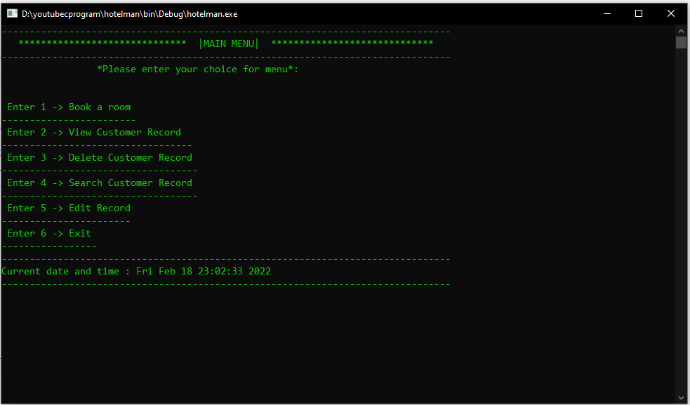

<div align="left" style="position: relative;">

<h1>HOTEL_MANAGEMEN_SYSTEM_C</h1>

<p align="left">
	
	
	
	
</p>
<p align="left">Built with the tools and technologies:</p>
<p align="left">
	
</p>
</div>
<br clear="right">

## 🔗 Quick Links


- [📁 Project Structure](#-project-structure)
- [🚀 Getting Started](#-getting-started)
  - [☑️ Prerequisites](#-prerequisites)
  - [⚙️ Installation](#-installation)
---


## 📁 Project Structure

```sh
└── hotel_managemen_system_c/
    ├── HMSC.c
    ├── LICENSE
    ├── README.md
    └── hotel.PNG
```


---
## 🚀 Getting Started

### ☑️ Prerequisites

Before getting started with hotel_managemen_system_c, ensure your runtime environment meets the following requirements:

- **Programming Language:** Error detecting primary_language: {'PNG': 1, 'c': 1}


### ⚙️ Installation

Install hotel_managemen_system_c using one of the following methods:

**Build from source:**

1. Clone the hotel_managemen_system_c repository:
```sh
❯ git clone https://github.com/1xcoder-1/hotel_managemen_system_c
```

2. Navigate to the project directory:
```sh
❯ cd hotel_managemen_system_c
```

3. Install the project dependencies:

echo 'INSERT-INSTALL-COMMAND-HERE'


<details closed>
<summary>Contributing Guidelines</summary>

1. **Fork the Repository**: Start by forking the project repository to your github account.
2. **Clone Locally**: Clone the forked repository to your local machine using a git client.
   ```sh
   git clone https://github.com/1xcoder-1/hotel_managemen_system_c
   ```
3. **Create a New Branch**: Always work on a new branch, giving it a descriptive name.
   ```sh
   git checkout -b new-feature-x
   ```
4. **Make Your Changes**: Develop and test your changes locally.
5. **Commit Your Changes**: Commit with a clear message describing your updates.
   ```sh
   git commit -m 'Implemented new feature x.'
   ```
6. **Push to github**: Push the changes to your forked repository.
   ```sh
   git push origin new-feature-x
   ```

# Demo



# LOGIN DETAILS:

Username: user

Password: pass
